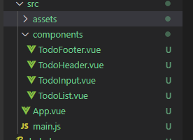
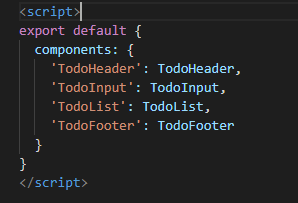
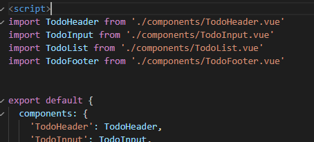
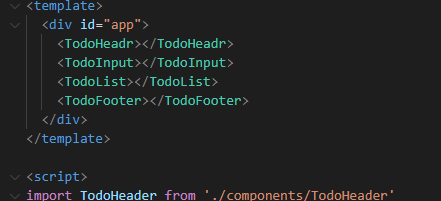

# 프로젝트 생성
```vue
vue init 프로젝트이름
```

# 컴포넌트 생성


src 폴더 밑에 components 폴더 생성하고 .vue 파일 만들기
(만약에 기능이 많아 지면 src - components - 기능별폴더 생성해서 거기에 .vue)


# 컴포넌트 등록


src/App.vue 에서 설정



components: {
	'컴포넌트 이름': 컴포넌트 내용
}

위 형식으로 컴포넌트 등록하고 




import 불러올 파일 내용 담긴 객체 from '위치';
위 형식으로 파일 내용 불러오기




template 안에 불러온 .vue 파일 추가하여 보여주기


